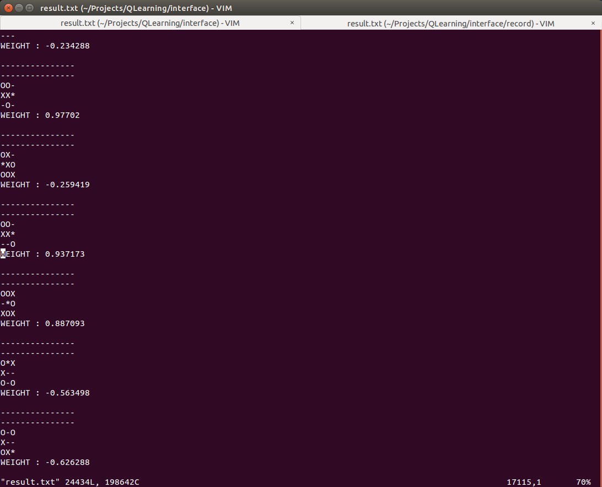

#Q-Learning : Tic Tac Toe!

- General Framework (at least an attempt at it)
- Working Example with Tic Tac Toe :

To DO:

- [ ] General Framework (applicability)
- [ ] Add ANN(Artificial Neural Network) to process input & output
- [ ] Improve hashing function

